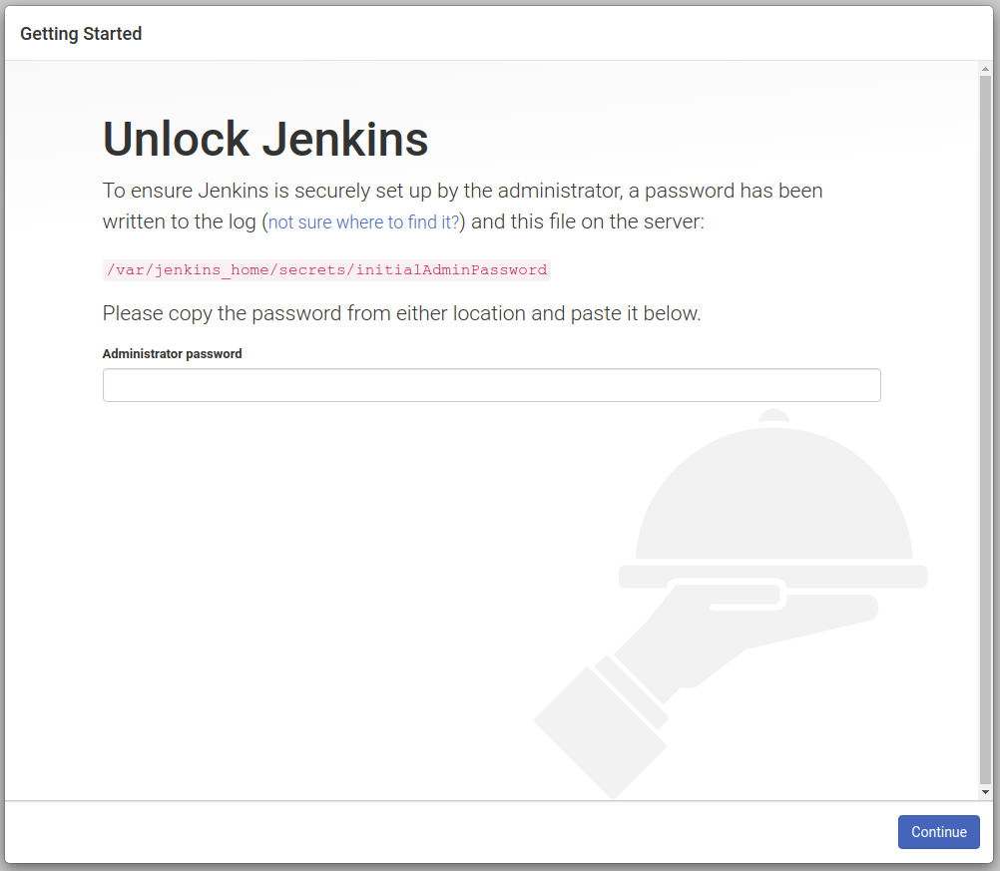

# Jenkins Container

## Run the container 

```bash
docker-compose -f docker-compose.yml up -d
```

## Check the service status and logs

```bash
docker ps -a # List the containers 
docker logs jenkins # Check the container logs
```

Jenkins up on [http://localhost:8080/](http://localhost:8080/)





**NOTE : TO GET DEFAULT PASSWORD**

```bash
docker exec -it jenkins cat /var/jenkins_home/secrets/initialAdminPassword
```

- `jenkins` - container name

## 1 Jenkins as a docker stack

```bash
cd tutorial/1/

docker stack deploy -c jenkins.yml jenkins
```

- Check with the stack services

```bash
docker stack ps jenkins
```

stop stack to go further

```bash
docker stack rm jenkins
```

## 2 Running Jenkins through DFP

```bash
cd tutorial/2/

docker network create -d overlay proxy

docker stack deploy -c proxy.yml proxy

docker stack ps proxy
```

Integrate jenkins with proxy

```bash
cd tutorial/2/

docker stack deploy -c jenkins.yml jenkins
```

## 3 Running Jenkins without manual setup

### Building Custom Jenkins Image

Running with persistency

```bash
cd tutorial/3/

docker build -t jinnabalu/jenkins .

docker push jinnabalu/jenkins
```

NOTE: jinnabalu is my docker hub user name.

### Create secrets

```bash
echo "admin" | docker secret create jenkins-user -

echo "admin" | docker secret create jenkins-pass -
```

### Run Jenkins

```bash
docker stack deploy -c jenkins.yml jenkins
```

## 4 Simulating Failure

Create job and and restart the machine or exit the jenkis as

In the browser *http://IP_OR_HOSTNAME/jenkins/exit*

it restarts in few minutes but looses it state when there are no volumes mounted in step 3.


